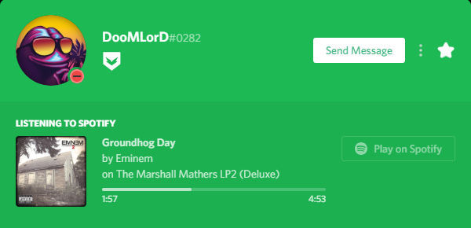

# Čo je to RPC?

#### Čo je to RPC a ako to funguje?

Boháta Prítomnosť je jedna z najkoolovejších vecí Discordu v tomto momente a v podstate zmení vzhľad a štýl vášho "hraje" rozhloy na vašom Discord profile. Podporujucé hry RPC Discordu \(ako napríklad GTA V™, Rainbow Six® Siege atď.\) vysielajú váš v-hre status na váš Discord profil koolovym spôsobom. V podstate použijú svoju aplikáciu na poslatie v-hre status do Discordu ktorý potom zkreslí informácie ako Bohatú Prítomnosť na váš profil. Konečne, stanú sa z nich v spôsobe pod obrázkom dole.

